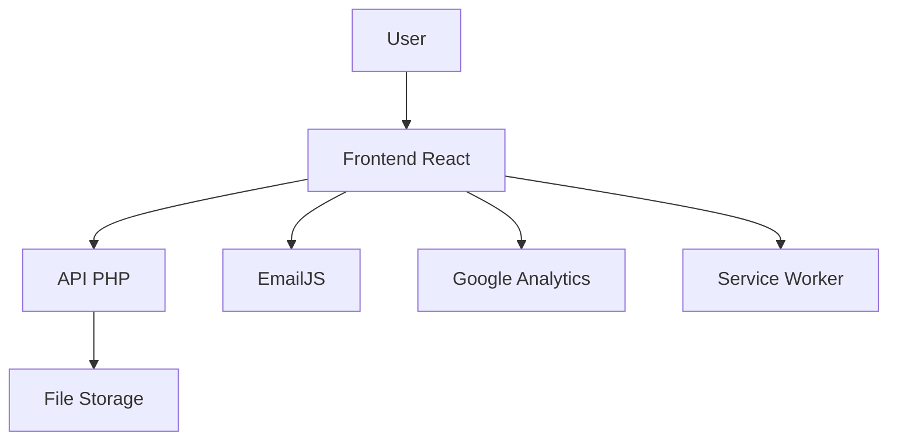

# 📸 Screenshots & Visuals

Collection de captures d'écran et visuels pour la documentation.

## 🎯 Screenshots recommandés

### 1. Page d'accueil (Hero)
**Fichier suggéré** : `docs/screenshots/homepage.png`
- Capture de la section hero avec animation
- Résolution : 1920x1080px
- Format : PNG ou JPEG optimisé

### 2. Section Projets
**Fichier suggéré** : `docs/screenshots/projects.png`
- Vue de la galerie de projets
- Résolution : 1920x1080px

### 3. Panneau d'administration
**Fichier suggéré** : `docs/screenshots/admin-dashboard.png`
- Dashboard admin avec gestion de fichiers
- Résolution : 1920x1080px

### 4. Responsive Mobile
**Fichier suggéré** : `docs/screenshots/mobile.png`
- Vue mobile du portfolio
- Résolution : 375x812px (iPhone)

### 5. Mode Sombre
**Fichier suggéré** : `docs/screenshots/dark-mode.png`
- Démonstration du mode sombre
- Résolution : 1920x1080px

## 🎬 GIF Animé (recommandé)

Créez un GIF de démonstration montrant :
1. Navigation entre les sections
2. Animations au scroll
3. Interactions (hover, click)
4. Switch mode clair/sombre

**Outils recommandés** :
- [ScreenToGif](https://www.screentogif.com/) (Windows)
- [Kap](https://getkap.co/) (macOS)
- [Peek](https://github.com/phw/peek) (Linux)
- [LICEcap](https://www.cockos.com/licecap/)

**Spécifications** :
- Durée : 10-30 secondes
- Taille : < 10MB
- FPS : 15-30
- Résolution : 1280x720px

## 📊 Diagrammes

### Architecture
Créez un diagramme d'architecture avec :
- [Mermaid.js](https://mermaid.js.org/)
- [Draw.io](https://app.diagrams.net/)
- [Excalidraw](https://excalidraw.com/)

### Exemple Mermaid

````markdown

````

## 🎨 Logo & Favicon

### Logo
**Fichier** : `public/logo.png`
- Format : PNG avec transparence
- Tailles : 512x512px (master)
- Versions : Light et Dark

### Favicon
**Fichiers** :
- `public/favicon.ico` (32x32px)
- `public/favicon-16x16.png`
- `public/favicon-32x32.png`
- `public/apple-touch-icon.png` (180x180px)
- `public/android-chrome-192x192.png`
- `public/android-chrome-512x512.png`

**Générer avec** :
- [Favicon.io](https://favicon.io/)
- [RealFaviconGenerator](https://realfavicongenerator.net/)

## 📋 Intégration dans README

### Avec screenshots

```markdown
## 📸 Aperçu

### 🏠 Page d'accueil


### 📱 Responsive Design
<div align="center">
  
</div>

### 🌙 Mode Sombre


### 👨‍💼 Panneau d'Administration

```

### Avec GIF

```markdown
## 🎬 Démonstration


*Navigation fluide avec animations et interactions*
```

### Galerie d'images

```markdown
## 📸 Galerie

<table>
  <tr>
    <td></td>
    <td></td>
  </tr>
  <tr>
    <td align="center">Page d'accueil</td>
    <td align="center">Projets</td>
  </tr>
  <tr>
    <td></td>
    <td></td>
  </tr>
  <tr>
    <td align="center">Compétences</td>
    <td align="center">Contact</td>
  </tr>
</table>
```

## 🎯 Badges personnalisés

### Avec logo personnalisé

```markdown
<!-- Utilisez votre logo via base64 ou URL -->

```

### Badges de stack technique

```markdown
## 🛠️ Technologies


```

## 📊 Statistiques GitHub

### Shields.io

```markdown


```

### GitHub Stats Cards

```markdown
## 📊 Statistiques


```

## 🎨 Bannière personnalisée

Créez une bannière personnalisée avec :
- [Canva](https://www.canva.com/)
- [Figma](https://www.figma.com/)
- [Photoshop](https://www.adobe.com/products/photoshop.html)

**Spécifications** :
- Taille : 1280x320px
- Format : PNG ou JPEG
- Inclure : Logo, nom du projet, tagline

**Utilisation** :
```markdown
<div align="center">
  
</div>
```

## 🖼️ Templates de visuels

### Badge "Made with"

```markdown


```

### Badge de statut

```markdown


```

### Badge de version

```markdown


```

## 📱 Social Media Cards

### Open Graph Meta Tags

```html
<!-- index.html -->
<head>
  <meta property="og:title" content="Votre Nom - Portfolio">
  <meta property="og:description" content="Portfolio personnel de développeur Full Stack">
  <meta property="og:image" content="https://votresite.com/og-image.png">
  <meta property="og:url" content="https://votresite.com">
  <meta property="og:type" content="website">

  <meta name="twitter:card" content="summary_large_image">
  <meta name="twitter:title" content="Votre Nom - Portfolio">
  <meta name="twitter:description" content="Portfolio personnel de développeur Full Stack">
  <meta name="twitter:image" content="https://votresite.com/twitter-image.png">
</head>
```

**Image OG recommandée** :
- Taille : 1200x630px
- Format : PNG ou JPEG
- Texte lisible et grand

## 🎬 Vidéo de présentation

### Hébergement

- YouTube (recommandé)
- Vimeo
- Loom

### Intégration README

```markdown
## 🎥 Présentation vidéo

[](https://www.youtube.com/watch?v=VIDEO_ID)

*Cliquez pour voir la démo complète (2 min)*
```

## 📋 Checklist visuels

- [ ] Logo du projet créé
- [ ] Favicon généré (tous formats)
- [ ] Screenshot page d'accueil
- [ ] Screenshot projets
- [ ] Screenshot admin
- [ ] Screenshot responsive mobile
- [ ] Screenshot mode sombre
- [ ] GIF de démonstration (< 10MB)
- [ ] Bannière personnalisée
- [ ] Image Open Graph (1200x630px)
- [ ] Image Twitter Card (1200x600px)
- [ ] Diagramme d'architecture

## 🛠️ Outils recommandés

### Capture d'écran
- **macOS** : Shift + Cmd + 4
- **Windows** : Win + Shift + S
- **Linux** : Flameshot, Shutter

### Optimisation d'images
- [TinyPNG](https://tinypng.com/)
- [Squoosh](https://squoosh.app/)
- [ImageOptim](https://imageoptim.com/)

### Édition
- [Figma](https://www.figma.com/)
- [Canva](https://www.canva.com/)
- [GIMP](https://www.gimp.org/)
- [Photopea](https://www.photopea.com/) (gratuit, en ligne)

### GIF
- [ScreenToGif](https://www.screentogif.com/)
- [Kap](https://getkap.co/)
- [Gifski](https://gif.ski/)
- [ezgif](https://ezgif.com/) (compression en ligne)

## 📝 Notes finales

- Optimisez tous les visuels avant commit
- Utilisez des chemins relatifs dans le README
- Testez l'affichage sur GitHub avant de pusher
- Gardez les fichiers visuels organisés dans `docs/screenshots/`
- Limitez la taille totale des images (< 20MB pour le repo)

---

**Astuce** : GitHub a une limite de 100MB par fichier. Hébergez les grosses vidéos sur YouTube/Vimeo plutôt que dans le repo.
